# 简介
  基于 GAS 框架，
# 目录
# 战斗系统
## 近战
  近战使用武士刀进行攻击。
  ### 普通攻击连段
  攻击有四连段，在前一段攻击的后摇阶段中再按攻击键会触发下一个连段，可触发连段的后摇时机在 Montage 中使用动画通知进行配置，连段的触发和调度逻辑由 Ability 控制。\
  还使用了 MontionWarping 进行攻击吸附，在近距离攻击时会将角色吸附到锁定目标的固定距离前。

  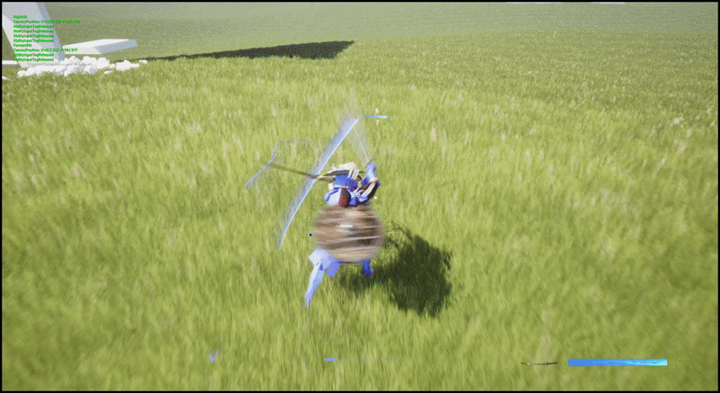

  ### 格挡反击
  使用输入触发 [格挡 Ability](Source/DX_InfiniteCombat/Private/GAS/GA/GA_Block.cpp)，播放 Montage，Ability 持续期间若角色前向受击，则免疫该伤害且对敌人进行反击。

  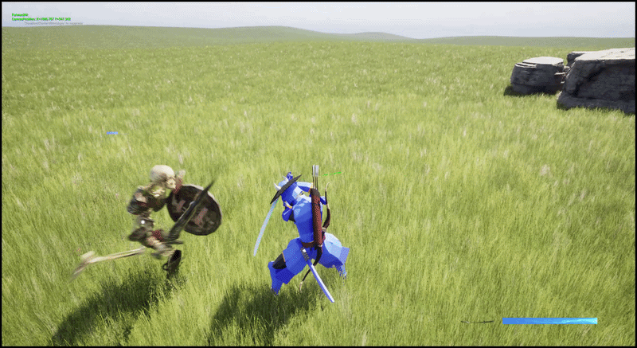
  
  ### 处决
  当敌人生命值到达斩杀线且 [GA_Execution](Source/DX_InfiniteCombat/Private/GAS/GA/GA_Execution.cpp) 的 CanActivateAbility 为 true 后，将显示处决按键，按下对应按键后触发处决 Ability ,使用 MotionWarping 令处决动画精准命中处决目标，LevelSequence 进行运镜。
  
  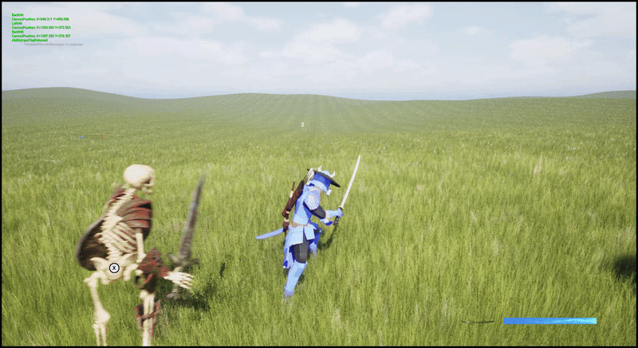
  
  
  ### 蓄力攻击
  长按攻击键到达一定时间后松开，使用 Ability Task 的 WaitInputReleased 监听按键释放事件，检测按下时间足够就触发蓄力攻击。

  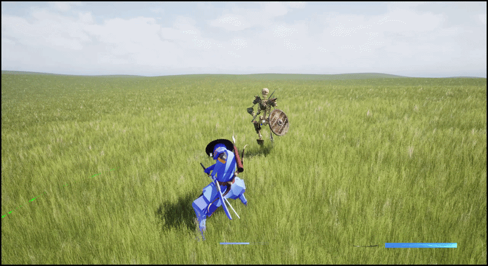

  ### 打击感/命中反馈
  当命中目标后调用 [AttackComponent](Source/DX_InfiniteCombat/Private/ICComponents/AttackComponent.cpp) 中的 HitFeedback 方法进行镜头抖动，短时的全局时间膨胀;\
  使用 Montage_SetPlayRate 对当前播放的攻击 Montage 进行缓速从而实现顿帧感；\
  可配置跳过当前播放的攻击 Montage 的一定帧数，从而实现抽帧效果；\
  伤害跳字，造成伤害时会跳出伤害数字，该跳字 UI 使用了对象池，避免频繁创建销毁，UI 对象池统一由一个[主 UI](Source/DX_InfiniteCombat/Private/UMG/WidgetCombatStates.cpp) 管理。
  
## 远程
  远程武器弓箭；\
  瞄准射击逻辑，将[时间轴封装到 c++ ](Source/DX_InfiniteCombat/Public/Utils/TimelineUtils.h)中，时间轴驱动[瞄准视角的切换](Source/DX_InfiniteCombat/Private/Character/DXCharacterExtensionComponent.cpp)；\
  箭矢发射使用了 UE 的 UProjectileMovementComponent，实现了一个 [ProjectorActorBase](Source/DX_InfiniteCombat/Private/Projector/ProjectorActorBase.cpp) 作为所有发射物的基类，其中扩展了伤害判定以及投射物命中后消失或附加到命中目标上的逻辑。
  
  

## 伤害判定/应用
  在 [AttackComponent](Source/DX_InfiniteCombat/Private/ICComponents/AttackComponent.cpp) 中提供攻击检测逻辑，在动画通知中调用;\
  命中目标后 调用 [AttackComponent](Source/DX_InfiniteCombat/Private/ICComponents/AttackComponent.cpp) 中接口构造 GameplayEffectContext 并对命中目标施加伤害 GE DamageEffect;\
  DamageEffect 使用[自定义的 Execution calculation class](Source/DX_InfiniteCombat/Private/GAS/ICDamageExecution.cpp)计算伤害；\
  在自定义 Execution 中，获取了目标的防御力，免伤数值，以及发起者的攻击力，然后使用了[自定义的 FGameplayEffectContext](Source/DX_InfiniteCombat/Public/GAS/ICGameplayEffectTypes.h)来传递本次伤害系数，在攻击的 Montage 动画通知状态中配置数值，便于为每一段攻击配置不同的伤害系数。

  ### 受击
  DamageEffect 中触发一个 [受击 GameplayCue](Source/DX_InfiniteCombat/Private/GAS/GC_AttakHit.cpp), 在 GameplayCue 中触发伤害跳字，命中音效以及播放受击 Montage；\
  根据不同受击方向会播放不同 Montage ，受击方向由命中点法线和命中目标的前向和右向向量夹角大小计算得出。

  后向
  
  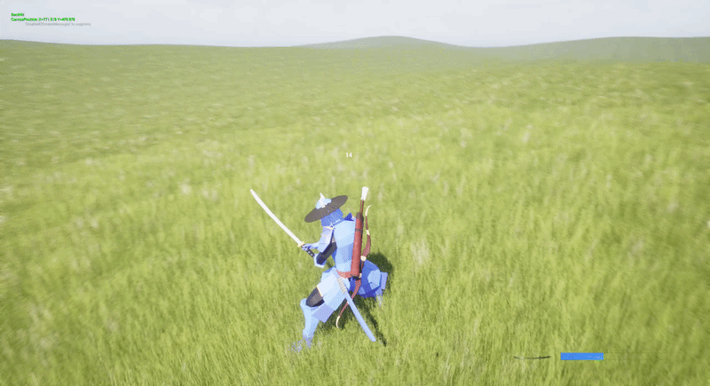
  
  前向
  
  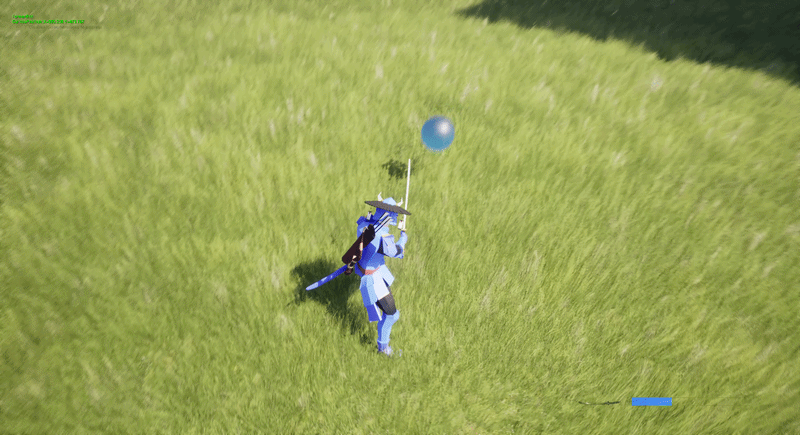
  
  左向
  
  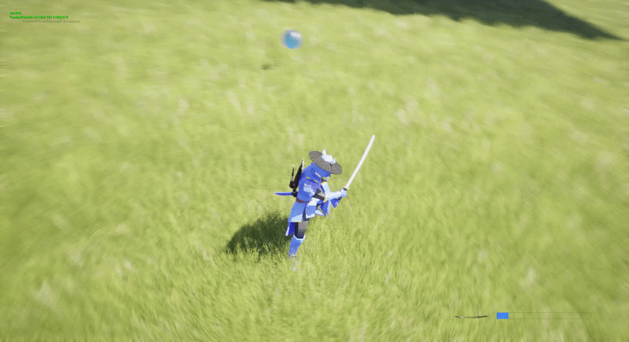
  
  右向
  
  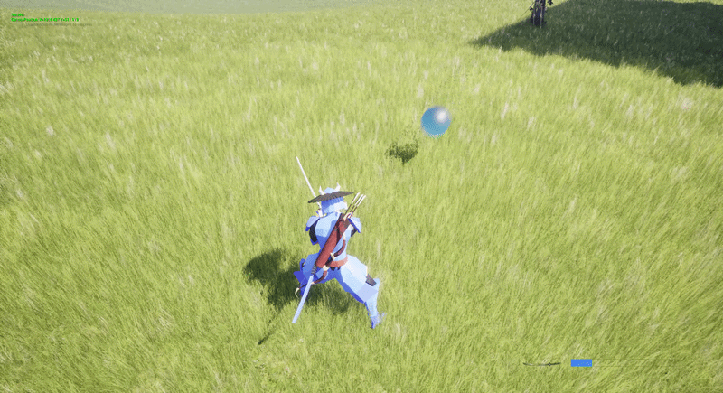
  
  ### 伤害免疫
  将 ASC 中的 OnImmunityBlockGameplayEffectDelegate 绑定到免疫事件，角色在冲刺时对自己施加一个免疫 DamageEffect 效果的 GE，在冲刺过程中受到伤害就会免疫伤害 GE 并触发免疫事件，用后处理材质实现色差效果。

  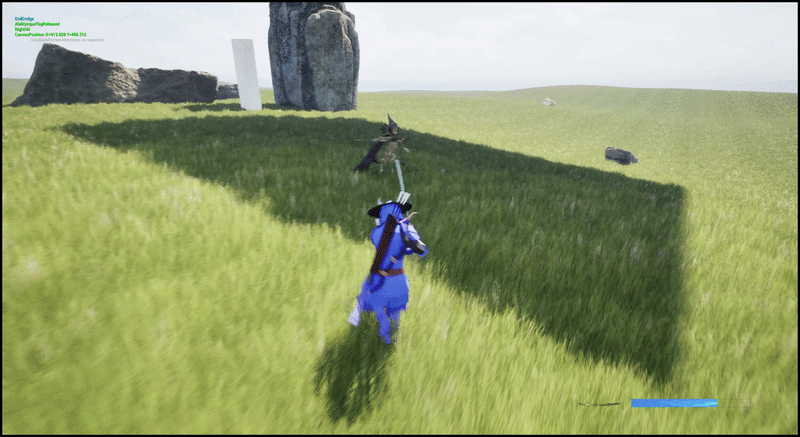
  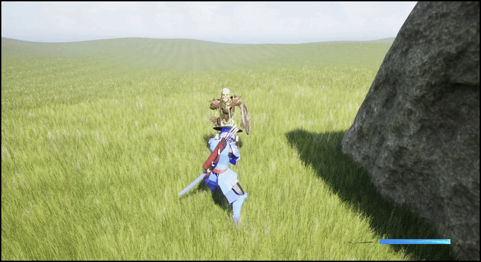
  
# 锁定系统
  [锁定组件](Source/DX_InfiniteCombat/Private/LockSystem/WeakLockComponent.cpp)
  锁定策略偏软锁定；为避免限制玩家操作，不会强制将控制器完全锁定在目标中心处，只会保持一定的可视屏幕边距，在一定时间内没有再触发锁定操作会自动取消锁定；\
  锁定到目标时，控制器仍然能够转动，只有在目标超出了屏幕范围，控制器才会平滑到锁定点离屏幕边缘 x 像素处，x 可配置，目前只在 [锁定组件](Source/DX_InfiniteCombat/Private/LockSystem/WeakLockComponent.cpp) 中配置一个值，但可改为每个锁定目标配置单独的值，从而在锁定不同体型敌人时保持不同的屏幕边距。

  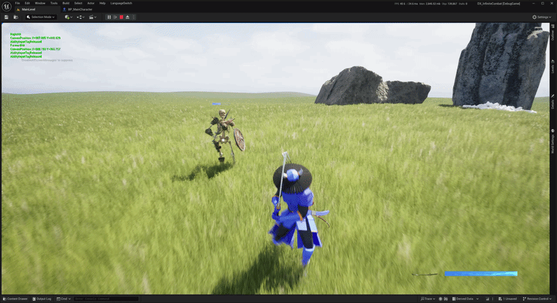
  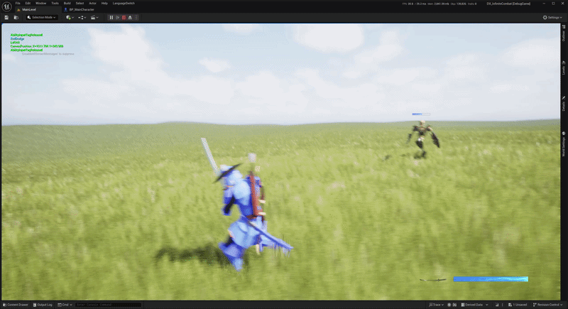

# GamplayAbilitySystem
  本项目使用了 UE 的 GAS 插件，除了基础移动输入其他主要行为触发基本都由 Ability 实现，主要是运用其 GamePlayTag 就能轻松配置各种行为之间的互斥，打断，阻挡关系，GE 对属性的修改，Debuff 施加也十分方便，但介于本项目是单机，对 GAS 网络同步方面的研究较浅；\
  主要的 Ability C++ 类 在[GA文件夹](Source/DX_InfiniteCombat/Private/GAS/GA)下，还有一些 Ability 是纯蓝图；\
  此外还[继承了 ASC ](Source/DX_InfiniteCombat/Private/GAS/ICAbilitySystemComponent.cpp)，对能力系统组件进行了扩展，主要是输入与 Ability 的绑定，让某些输入通过配置就能直接触发只能 Ability，然后还有一些对 ActivateAbility 和 SetByCaller 的封装。
  
# 运动系统
## 攀上障碍
  在[Traversal Ability](Source/DX_InfiniteCombat/Private/GAS/GA/GA_Traversal.cpp) 中，使用胶囊体扫描，模拟角色攀登路径，确认碰撞条件满足，再判断落点是否满足可站立条件，都满足后触发 Montage 播放；\
  使用 MotionWarping ，实现了同一个根运动动画能够精确攀上不同高度障碍物的效果。

  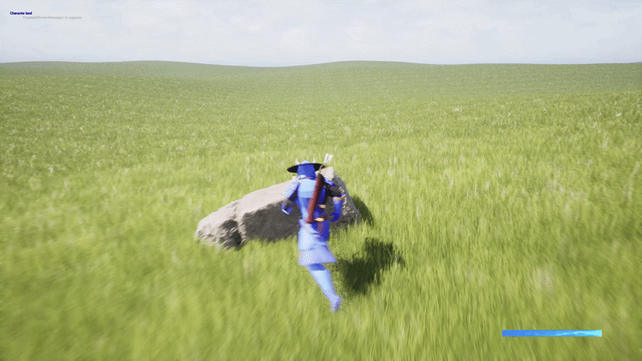
  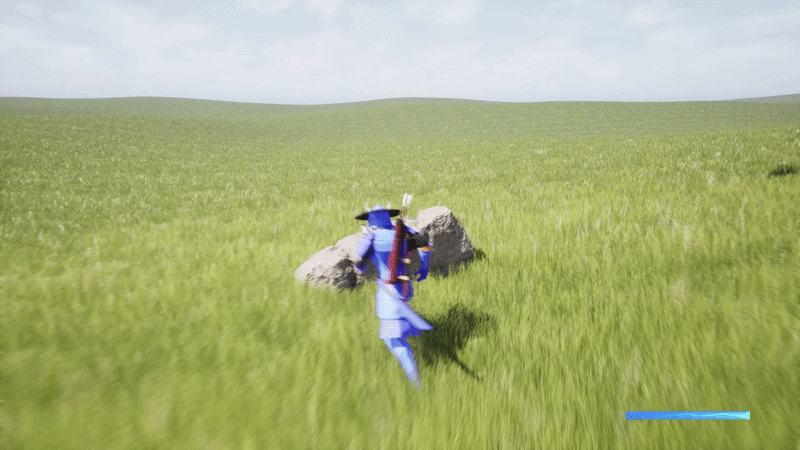
  
## 攀爬墙体
  [扩展移动组件](Source/DX_InfiniteCombat/Private/ICComponents/ICCharacterMovementComponent.cpp)，重写 PhysCustom 扩展了新的移动模式 PhysClimbing，沿用了 PhysWalking 的分步模拟思路，每个子步中, FindAndUpdateClimbSurface() 分部位进行多个球形探测，对多个命中结果进行筛选和加权平均获取墙面信息；\
  UpdateClimbingAcceleration() 中对获取到的墙面法线进行投影和叉乘，获得墙面坐标系，然后用点积的方式获取加速度在移动输入前向和右向的投影长度，将其分别乘到墙面坐标系的上方向向量和右方向向量， 最后将这两个向量相加得到最新的加速度，由 CalcVelocity 由加速度和摩擦力等计算出速度后，在 ClimbAlongSurface() 中将速度转换为实际的位移 MoveDelta，SafeMoveUpdatedComponent 做实际的移动；\
  当攀爬到墙壁顶部时，上半身的球形探测未命中，下半身球形探测命中，此时将尝试攀上墙顶，攀上墙顶则是复用的上面的攀上障碍逻辑；

  
  

# 动画表现
## IK
  ### 脚部 IK
  ### 手部 IK
  
## 基础运动
  多线程；
  GAS GameplayTag 绑定；
  Locomotion;
  脚同步；
  过渡；
  瞄准空间；
  混合空间；
  分层混合上半身动画；
  原地转向；

## 动画重定向

# 资源管理
  AssetManager;
  软引用；
  
# 存档
  存档管理器；
  存档索引；
  版本号，版本转换；
  
# AI
  感官组件；
  EQS 环境查询;
  
# 用户自定义输入
# 编辑器扩展
  slate 编程；

# 连招系统
  前缀树...
