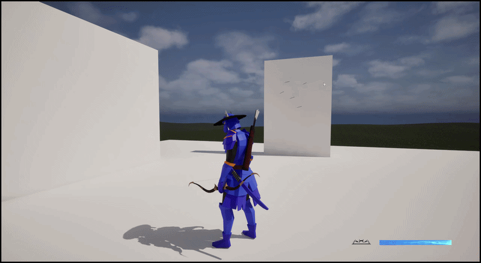

# 简介
  基于 GAS 框架，
# 目录
# 战斗系统
## 近战
  近战使用武士刀进行攻击；
  格挡；
  处决；
  拼刀；
## 远程
  切换远程武器弓箭；
  
  
  
  瞄准射击，将时间轴封装到 c++ 中，时间轴驱动瞄准视角的切换；
# 锁定系统
[代码](Source/DX_InfiniteCombat/Public/LockSystem/WeakLockComponent.h)
  锁定策略，软锁定；
# GAS
  GA;
  GE;
  GC;
# 运动系统
## 攀越障碍
## 攀爬墙体
## 动画
### 动画重定向
### 基础运动
### IK
# 资源管理
  AssetManager;
  软引用；
# 存档
# AI
# 连招系统
